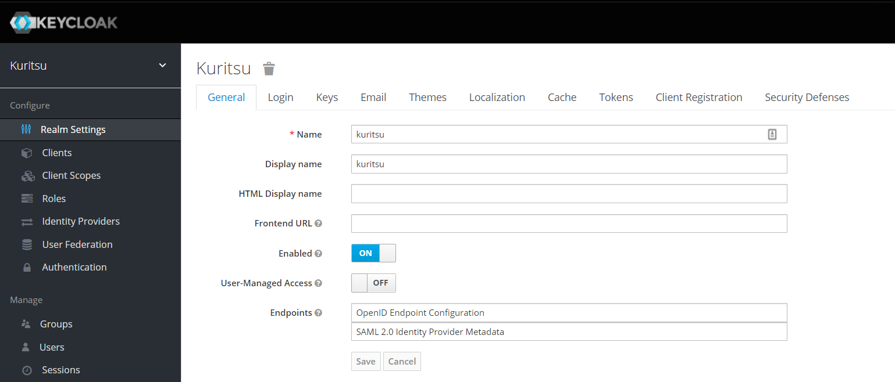
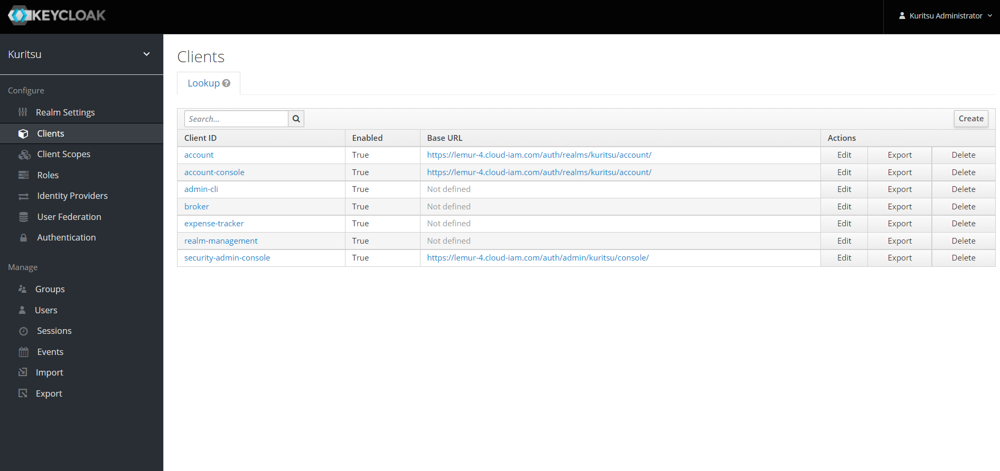

# heroku-expense-tracker-back
## Description
This is a personal project to explore usage of Heroku. I've previously created a similar project
to explore AWS features but after the free-tier period expired, I figured the cost of simply letting 
the deployed application idle were quite high. Hence, the switch to Heroku with a free hobby plan.

## Journey logs
### 1 Deploying Spring Boot application to Heroku
As deployment would likely be part of a CI/CD process, I've chosen to handle deployment to Heroku using `heroku-maven-plugin`.

Here are the steps I've followed:
1. Sign up on Heroku
2. Create an application named `heroku-expense-tracker-back`
3. Create a Spring Boot application
4. In `application.properties`, inject the `PORT` environment variable to the `server.port` property:
`server.property=${PORT}`. Heroku serves applications behind a reverse-proxy, and at startup of an 
   application, will assign a port to it. While the user is always using the same URL to access a Heroku 
   app, behind the scenes, the port assign to it will likely change every time it is put to sleep and awaken.
5. For local deployment, define an environment variable named `PORT` and gives it the Heroku API key as value.
This key can be found in the user settings in Heroku
6. Add `heroku-maven-plugin` plugin to the `pom.xml` and add the following configuration:
```xml
<configuration>
    <appName>heroku-expense-tracker-back</appName>
    <jdkVersion>13</jdkVersion>
    <processTypes>
    <web>java $JAVA_OPTS -cp target/classes:target/dependency/* be.kuritsu.hetb.HerokuExpenseTrackerBackApplication</web>
    </processTypes>
</configuration>
```
7. To manually deploy, run `mvn heroku:deploy`

### 2 Configuring PostgreSQL
#### On Heroku
1. From the Heroku web dashboard, provision Heroku PostgreSQL (free Hobby Dev plan) to `heroku-expense-tracker-back` plan.
2. In `application.properties`, inject the `DATABASE_URL` environment variable that is set by Heroku
3. Define a Spring configuration that will be applied when `heroku` profile is enabled, to build a DataSource bean based on the DB URL set by Heroku
4. Adapt `heroku-maven-plugin` configuration to have Heroku start the application using the `heroku` Spring profile
#### Locally
As I didn't want to install PostgreSQL locally I've decided to use a Dockerized version of it. 

So, I've defined a `docker-composes.ymal` file in which a `postgres` container is defined as well as a volume to hold the DB data.

### 3 Enabling Liquibase
1. In `application.properties`, enabling Liquibase, specifying the driver class to use and specifying the path to the changelog file:
```properties
spring.liquibase.enabled=true
spring.liquibase.driver-class-name=org.postgresql.Driver
spring.liquibase.change-log=db/changelog/db.changelog-master.xml
```
2. Add maven dependencies:
   - `spring-boot-starter-jdbc`, mainly to get necessary DataSource implementation classes and Connection Pool classes
   - `postgresql` to get the PostgreSQL driver necessary to Liquibase
   - 'liquibase-core'
   
### 4 CI/CD : CircleCI
Setup a CircleCI project using their template -> adding `.circleci/config.yaml` file

### 5 Code analysis : SonarCloud
In SonarCloud, create a new project:
   - organization = `khyiu` (my github username)
   - project = the current project
   - select CircleCI as analysis source
   - follow the instructions to create a CircleCI context + add the environment variables
   - select maven as being the build tool and follow the instructions to complete the Maven config + the CircleCI `config.yml` files

### 6 Authentication/authorization using OpenID Connect - Keycloak
#### Setting up Keycloak
   1. Sign up in [Cloud-IAM](https://www.cloud-iam.com/): Cloud IAM provides Keycloak servers as a service
   2. Select the **Little Lemur** plan. This plan is free and offers 1 Keycloak realm with up to 100 users, which is more than enough for a personal project
   3. In the realm settings, name the realm `kuritsu`  
  

   4. In the "clients" section, create a new one and name it `expense-tracker`. This client will allow the current application to use Keycloak to handle authentication  



   5. In the `expense-tracker` client details, in the the "settings" tab, set "access type" to `confidential`. That will provide an extra "Credentials" tab
   6. in the "Credentials" tab, select `Client ID and secret` as "Client Authenticator". As of now, client ID and client secret must be provided in the request to retrieve an access token
   7. In the "Roles" section, create a role named `expense-tracker-user`. Later, we'll inject this role as a granted authority in the Spring Security context during the OIDC authentication process.
   8. In the "Users" section, create the users that'll be using this application

#### Integrate Keycloak with Spring Boot app
##### Maven
Add the following to the Maven configuration:
``` XML
...
<dependencyManagement>
     <dependencies>
         <dependency>
             <groupId>org.keycloak.bom</groupId>
             <artifactId>keycloak-adapter-bom</artifactId>
             <version>${keycloak.version}</version>
             <type>pom</type>
             <scope>import</scope>
         </dependency>
     </dependencies>
 </dependencyManagement>
...
```

And the following dependencies
``` XML
<dependencies>
	<dependency>
		<groupId>org.keycloak</groupId>
		<artifactId>keycloak-spring-boot-starter</artifactId>
	</dependency>
	<dependency>
		<groupId>org.springframework.boot</groupId>
		<artifactId>spring-boot-starter-security</artifactId>
	</dependency>
	<dependency>
		<groupId>org.springframework.boot</groupId>
		<artifactId>spring-boot-starter-oauth2-resource-server</artifactId>
	</dependency>
</dependencies>
```

##### Spring Boot configuration
Add the following properties to `application.properties`

``` Properties
keycloak.auth-server-url=https://lemur-4.cloud-iam.com/auth
keycloak.realm=kuritsu
keycloak.resource=expense-tracker